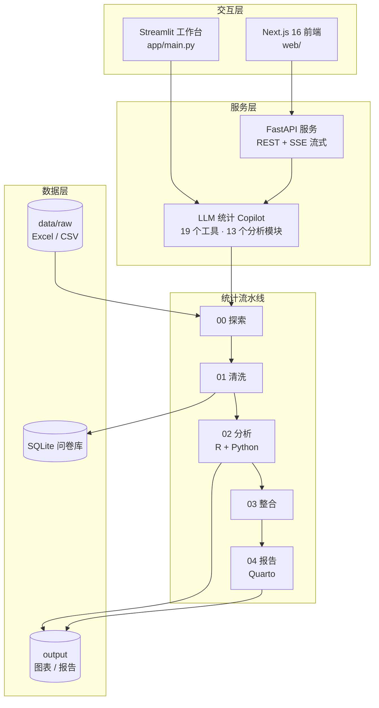

<div align="center">

<a name="top"></a>

# 📋 Survey Analysis Platform

**模块化 SPSS 风格问卷统计分析平台 — R + Python + Streamlit + Quarto + LLM Agent**  
*A modular SPSS-style statistical analysis platform for survey data science*

<p>


</p>

<p>


</p>

</div>

---

## 📖 目录

- [🌟 项目简介](#-项目简介)
- [🏗 系统架构](#-系统架构)
- [⚡ 核心特性](#-核心特性)
- [🛠️ 技术栈](#️-技术栈)
- [🚀 快速开始](#-快速开始)
- [📁 项目结构](#-项目结构)
- [🗺️ 路线图](#️-路线图)
- [📚 文档](#-文档)
- [📄 许可证](#-许可证)

---

## 🌟 项目简介

**Survey Analysis Platform** 是一套面向问卷调查、社会科学实证与商业洞察的工业级统计分析系统。系统结合 **R 语言在经典计量与 SPSS 统计检验上的严谨性**（信效度分析、方差分析 ANOVA、多元回归、中介与调节效应）与 **Python 全栈 / LLM Agent 的交互与工程自动化能力**，实现“探索 → 清洗 → 统计检验 → 整合 → Quarto 自动化报告”全流水线。

---

## 🏗 系统架构



---

## ⚡ 核心特性

| 特性 | 说明 |
|---|---|
| 📊 经典描述与交叉检验 | 卡方检验、独立样本 T 检验、单因素与双因素 ANOVA |
| 📐 测量模型评估 | Cronbach's α 信度、探索性因子分析（EFA）、验证性因子分析（CFA） |
| 📈 高级回归与结构方程 | 多元线性回归、Logistic 回归、Bootstrap 中介与调节效应模型 |
| 🤖 LLM 统计 Copilot | 对话式驱动分析流水线：19 个注册工具、13 个分析模块，SSE 流式输出推理与工具调用过程 |
| 🖥️ 双前端 | Streamlit 分析工作台（对话 + 数据 + 图表画廊 + 报告中心）与 Next.js 16 Web 界面共用同一 FastAPI 后端 |
| 📄 Quarto 报告自动化 | 一键编译输出 publication-grade HTML / PDF 学术与咨询分析报告 |

---

## 🛠️ 技术栈

| 层次 | 技术选型 | 说明 |
|---|---|---|
| 统计内核 | R 4.x · Python 3.10+（statsmodels / scikit-learn / pandas） | `lib/`、`pipeline/` |
| LLM Agent | DeepSeek（对话）· 自研工具调度与计划审核门 | `app/agent.py`、`app/tools.py` |
| 分析工作台 | Streamlit | `app/main.py` |
| API 服务 | FastAPI（REST + SSE） | `app/api.py` |
| Web 前端 | Next.js 16 · React 19 · Tailwind CSS 4 | `web/` |
| 报告 | Quarto | `pipeline/04-report/` |
| 可观测性 | Langfuse | 见 `docs/observability-langfuse.md` |

---

## 🚀 快速开始

### 前置要求

- Python 3.10+、R 4.x（含 Rscript）、Quarto
- Node.js 20+（仅 Next.js 前端需要）
- 环境变量 `DEEPSEEK_API_KEY` — **必填**，未设置时工作台会拒绝启动

### 1. 安装依赖

```bash
git clone https://github.com/CHINGBOH/survey-analysis-platform.git
cd survey-analysis-platform
pip install -r requirements.txt
```

### 2. 启动服务（按需选择）

```bash
# Streamlit 可视化工作台（:8501）
streamlit run app/main.py --server.port 8501

# FastAPI 统计计算服务（:8000，REST + SSE）
uvicorn app.api:app --port 8000

# Next.js Web 前端（:3000，依赖上面的 FastAPI 服务）
cd web && npm install && npm run dev
```

> 注：根目录 `main.py` 为 CLI 指引入口，打印各可用入口的启动命令；`--run-pipeline` 参数目前仅打印占位信息。

---

## 📁 项目结构

```text
survey-analysis-platform/
├── pipeline/             # 统计流水线：00-explore → 01-clean → 02-analyze → 03-integrate → 04-report
├── app/                  # Streamlit 工作台 + FastAPI 服务 + Agent 核心
│   ├── agent.py          # LLM Agent 主循环与工具调度
│   ├── tools.py          # 19 个分析工具注册
│   ├── api.py            # FastAPI REST + SSE 接口
│   ├── main.py           # Streamlit 入口
│   └── ui/               # Streamlit 页面组件
├── web/                  # Next.js 16 / React 19 前端
├── agent/                # Agent 系统提示词、技能与子代理定义
├── lib/                  # R & Python 核心统计算法与 SPSS 格式化输出库
├── docs/                 # 统计方法目录、系统架构与可观测性文档
├── main.py               # CLI 指引入口
└── requirements.txt      # Python 依赖清单
```

---

## 🗺️ 路线图

- [x] 五阶段统计流水线（探索 → 清洗 → 分析 → 整合 → 报告）
- [x] Streamlit 分析工作台与 FastAPI（REST + SSE）服务
- [x] LLM 统计 Copilot（19 工具 / 13 分析模块）
- [x] Next.js 16 Web 前端
- [ ] 报告阶段目录合并（`03-report` 与 `04-report` 并存待清理）
- [ ] 多用户 / 多会话状态隔离（当前为进程内单例）
- [ ] 自动化测试与 CI
- [ ] Makefile 与运维脚本随仓库发布

---

## 📚 文档

| 文档 | 说明 |
|---|---|
| [文档索引](docs/INDEX.md) | 全部文档导航 |
| [系统架构](docs/architecture.md) | 分层架构与设计决策 |
| [SPSS 方法目录](docs/spss-method-catalog.md) | 统计检验方法全集（64KB 参考手册） |
| [描述统计模块](docs/module-descriptives.md) | 模块设计示例 |
| [Agent 框架调研](docs/agent-framework-research.md) | Agent 方案选型与对比 |
| [Langfuse 可观测性](docs/observability-langfuse.md) | 链路追踪接入指南 |

---

## 📄 许可证

本项目基于 [MIT License](LICENSE) 开源。

---

<p align="right">(<a href="#top">回到顶部</a>)</p>
